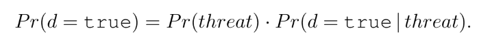
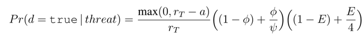
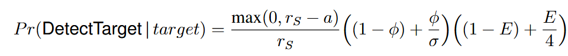

# DART UAV

The DART (Distributed Adaptive Real-Time) Systems project at the Carnegie Mellon Software
Engineering Institute implements a simulated team of unmanned aerial vehicles (UAVs) performing 
a reconnaissance mission in a hostile environment. The mission of the team is to fly a planned
route at constant speed across an area to detect as many targets on the ground as possible. At the
same time, the team must try to avoid being shot down by threats in the area, which would result
in the failure of the mission. As the team flies during the mission, it discovers the environment
(i.e., the location of targets and threats) with some uncertainty, and plans to adapt its altitude,
formation, and other configurations for a finite horizon, accordingly. The team continues the
cycle of planning and execution until it has reached the end of the route, or it is shot down by
threats.

The team has two long-range forward-looking sensors to monitor the state of the environment for 
a fixed horizon ahead of the team: one for sensing targets and the other for sensing threats. 
The route is divided into segments of equal length. For each route segment in front of
the sensor, it reports whether it detects a target/threat. Due to sensing errors, these reports can
be false positive or false negative. The team therefore would get multiple observations to construct 
a probability distribution of target or threat presence in each route segment ahead. These
probability distributions will be used in mission planning.

To detect targets on the ground, the team uses a downward-looking sensor as it flies over.
The closer the UAVs fly to the ground, the more likely they are to detect the targets, but also
the higher probability of being destroyed by a threat. The team can be in either loose or tight
formation. Flying in tight formation reduces the probability of being shot down; however, it also
reduces the target detection probability due to sensor occlusion or overlap. The team can use
electronic countermeasures (ECM) to reduce the probability of being destroyed by threats, but
using ECM also reduce the probability of target detection.

Using the probability distributions of targets and threats ahead of the team constructed from
observations, the team plans for any necessary adaptation to change the team's configuration or
altitude to balance the objectives of maximizing the number of targets detected and minimizing
the probability of being destroyed by threats.


## Modeling the planning domain with XMDP XPlanner APIs

To generate a contrastive explanation for a plan (as well as a plan itself) requires modeling the planning problem 
in the XPlanning framework, which involves defining (1) the state space for the problem (e.g., the altitude and formation 
of the UAV team); (2) the actions that can be applied in states to transition the MDP to new states; (3) a factored representation
of states X actions -> new states that capture the conditions in states where actions can be applied, and the probability
distribution of new states that will be transitioned to after applying an action; (4) the qualities that will be used to determine
whether plans are good (called rewards in MDP) and the costs, which are negative rewards; and (5) the initial state of the system and goal
for the planner to achieve.

To bring this all together into a planning problem requires defining an `XMDPBuilder` object that defines these actions, either directly
(hardcoded in the class), or (more commonly) by taking some textual representation of a mission and using that to generate the XMDP planning 
description.


### State Variables

State variables represent information about states in the MDP, and are implemented by implementing state interfaces provided in the package:
`language.domain.models`.  Each of these state variables is modeled in XMDP by implementing the `language.domain.models.IStateVarValue` 
interface or one of its primitive derivatives: `IStateVarInt`, `IStateVarDouble` or `IStateVarBoolean`, which provide state variables 
represented by integers, doubles, or booleans respectively. Furthermore, any state variable may have attributes that provide more detail about 
the state variable. Such information might, for example, describe the units of the state variable, or the probability distribution of the value.

The state space for the team of UAVs is defined by five variables: 

- [Altitude levels](models/Altitude.java): an integer state variable, which is a discrete set of altitude levels that the UAV team can fly at, 
- [Team formation](models/TeamFormation.java): a custom state variable representing an enumeration of tight or loose formation, 
- [ECM status](models/TeamECM.java): a boolean variable indicating if electronic countermeasures have been deployed by the team: on(true) or off(false), 
- [Route segment](models/RouteSegment.java): and integer state variable representing the the segments of the map that the team can be above,
- [Team destroyed](models/TeamDestroyed): whether the team has been destroyed by threats

As mentioned above, XMDP allows us to define attributes associated with state variables that can be used in planning to provide additional 
information about the state variable. For the UAVs, we define `Route segment` variables to have the following attributes:

- [TargetDistribution](models/TargetDistribution.java) which represents the probability of targets of interest within the segment 
- [ThreatDistribution](models/ThreatDistribution.java) which represents the probability of threats within the segment.

Each of these attributes in XMDP is modeled by implementing the class `language.domain.models.IStateVarAttribute` 
and passed to the constructor for [RoutSegment](models/RouteSegment.java). The method `getAttributeValue` can be used to 
retrieve these attributes.

The above classes represent the types of states in the MDP. To define the state space requires specifying the possible values that these state variables can take 
(i.e., defining the actual values that can be used as states in the MDP). To do this requires defining a `language.domain.models.StateVarDefinition`
that specifies the name of the state variable and the set of instances of defined state variable classes that indicate the possible values in the domain.


### Actions

To define the possible actions that can be applied in the MDP, XMDP provides the `language.domain.models.IAction` interface. Note that actions are representations of the possible actions that can be performed, and do not execute the actions themselves. The effects of actions on states are defined in the transition model.

An `Action` in XMDP is composed of a name for the action, any parameters (state variable values) for the action, and attributes. 

For the UAV example, we define the following action types:

- Increase Altitude ([IncAltAction](models/IncAltAction.java)): to increase the altitude of the team. The action takes an altitude change, which represents the increase in altitude level that this action will increase. 
- Decrease Altitude ([DecAltAction.java](models/DecAltAction.java)): to decrease the altitude of the team. The action takes an altitude change, which represents the increase in altitude level that this action will increase. 
- Fly ([FlyAction](models/FlyAction.java)): fly the team at its current altitude. 
- Change Formation ([ChangeForm.java](models/ChangeForm.java)): denotes an action to change formation of the team. It is parameterized by a `TeamFormation` argument denoting the target formation: `ChangeForm(φtarget : TeamFormation)`
- Switch Electronic Countermeasures ([SwitchECM.java](models/SwithECM.java)): denotes the action to switch on and off the team's ECM. It is parameterized by a `TeamECM` state variable - either on or off.

For specification convenience, we incorporate type hierarchy for action types to allow reuse
of factored PSOs describing the actions' preconditions and effects on individual or groups of
variables. For instance, `IncAlt`, `DecAlt` and `Fly` actions all have an effect of advancing the team
forward by 1 route segment. We create a supertype [IDurativeAction](models/IDurativeAction.java) with the factored PSO 
specifying the effect of advancing `t`'s value by 1. When defining `IncAlt`, `DecAlt` and `Fly` as subtypes
of `IDurativeAction`, they automatically inherit its factored PSO of the effect on `t`. Although, 
subtypes are allowed to have additional preconditions, that is, the subtypes' preconditions can be
stronger than (and subsume) its supertype's precondition. 


### Transition model

Transition models describe how states and actions can be used to transition to other states. A transition model requires specifying the following:

1. The types of state variables that a transition can use as a source, called the discriminant class. For example, in the UAV case, the `DecAlt` action's discriminants are the team's altitude and whether the team has been deployed. These discriminants specify the state variable types on which the action may execute.
2. The preconditions for the transition (for example, any DecAlt action can only be applied if the team isn't destroyed and the altitude of the team is greater than the altitude to decrease). (Note: preconditions will not be discussed in this section - they are defined when the XMDP planning problem is composed together in the last step.)
3. The state variable type(s) that the action will effect, called the effect class
4. The effect that the transition has on the state, as a probabilistic effect. For example, for `DecAlt` the action effect is to change the altitude. 

1, 3, and 4 are specified by implementing the `language.mdp.IActionDescription` interface. 1 and 3 use classes defined in the state variable model, and 4 is implemented to return a `language.mdp.ProbabilisticEffect`. In most cases where the effect is the result of some formula, the `IActionDescription` implementation will delegate to a `language.mdp.FormulaActionDescription` instance which is a generic action description of a specific effect class. 
A "formula" action description functionally maps a set of mutually exclusive discriminants to the corresponding probabilistic
effects. This description will further delegate to a `language.domain.models.IProbabilisticTransitionFormula` specialized for the action that calculates the result of applying the action in the state.

If we look at the class [DecAltAltitudeActionDescription](models/DecAltAltitudeActionDescription), we can see all this information put together in the constructor: the discriminant classes, as mentioned, are the Altitude and whether the team is destroyed, the effect class is the Altitude, and the effect is an implementation of `IProbabilisticTransitionFormula` (DecAltAltitudeFormula) for the action type. The `formula` method in this case gets the current value for the altitude, 

We use
factored PSOs (modeled by implementing `IProbabilisticTransitionFormula`) to describe the preconditions and context-dependent, probabilistic effects of each
action type.

Each of these movement actions also come with the possibility that the team will be shot down by a threat.
Recall that all action subtypes inherit factored PSOs from their action supertype. 
The `DurativeAction` supertype has effects on the variables `t` and `d`,
respectively.  Executing a `DurativeAction` has a probability of resulting in the
team being shot down by threats. The probability of the team being destroyed in a single 
transition (i.e., the team flying over a route segment) is equal to the probability of a threat existing in
a given route segment times the probability of the team being shot down by the threat given one
exists:



The effect of this action is described by the [RouteSegmentActionDescription](models/RouteSegmentActionDescription.java) 
class, which specifies that an action has the effect of changing the state to the next route segment.

The team has uncertain information about the threat presence in each route segment
ahead, in the form of a β-distribution. The β-distribution of threat presence in each route segment
is specified as the attribute ThreatDistribution of the RouteSegment type. For simplicity, we
use the expected value of the target β-distribution as P r(threat). Recall also that the probability
of the team being shot down by a threat, given one exists, depends on the team’s altitude level,
formation, and ECM status. Specifically,

 

where r<sub>T</sub> is the threat range (i.e., at a altitude of rT or higher, it is not possible for threats to shoot
down the team); ψ is the factor by which the probability of the team being destroyed is reduced
due to flying in tight formation; and when ECM is used, the probability of being destroyed is
reduced by a factor of 4. We explicitly encode the above analytic model of `Pr(d = true)` in
the corresponding factored PSO of `DurativeAction`, i.e. in the class [TeamDestroyedActionDescription](models/TeamDestroyedActionDescription.java). The effect probabilities depend on the altitude of the team, its formation, and whether countermeasures are deployed.

The `ChangeForm(φtarget:TeamFormation)` and `SwitchECM(Etarget:TeamECM)` action types are 
instantaneous actions (i.e., they do not impact `t`).  The preconditions of these action types are: `d=false` 
and that the team’s current formation and ECM status is different from the target ones, respectively. Their effects 
are deterministic: changing the team’s formation and ECM status accordingly.

Lastly, the helper action type `Tick` also inherits the factored PSOs from its supertype `DurativeAction`. 
However, unlike the action types `IncAlt`, `DecAlt` and `Fly`, it overrides the factored PSO of the effect 
on `t` with an additional precondition that the team must have already been destroyed: `d=true`. `Tick` is 
the only applicable action once the team has been destroyed. It only advances `t` to reflect the passage of time, 
and does not have any other effect. This allows the expected number of targets missed after the team has been 
destroyed to accrue over the remaining route segments ahead.


### Quality Attribute Analytic Models

We  define  the  following  quality  attributes  (QAs):  the expected number of targets detected, and the probability 
of being destroyed by threats.

However, since our approach uses cost functions for XMDPs, we need all QA objectives to be minimization objectives.  
Therefore, for the team’s objective to maximize the number of targets detected, we create an equivalent, dual objective 
to minimize the number of targets missed.  We use the targets-missed minimization objective in the cost functionCof the XMDP.

For the purpose of explanations,  however,  it is more comprehensible to communicate the expected number of targets detected 
to the users. Therefore, our approach maintains the dual QAfunctions of targets-missed and targets-detected, and uses the 
latter to compute and report the expected number of targets detected in explanations.

For brevity, here we only discuss the QA function for the expected number of targets missed,and we omit the dual function 
for the expected number of targets detected.

**Number of targets missed**: We define `MissTarget` as an event for a count-of-events QA. This event is associated with 
a `DurativeAction` type.  That is, the team can miss a target when flying over a route segment via a `IncAlt`, 
`DecAlt`, or `Fly` action, or it can miss a target in a remaining unexplored route segment after the team has been 
destroyed by threats, via a `Tick` action. The probability of `MissTarget` event occurring in a single transition 
(via a `DurativeAction`) is equal to the probability of a target existing in the corresponding route segment times the
probability of the team failing to detect the target given one exists:

`Pr(MissTarget) = Pr(target) * Pr(MissTarget|target)`

Recall that the team has uncertain information about the target presence in each route segment ahead, in the form of a 
β-distribution. The β-distribution of target presence in each route segment is specified as the attribute 
`TargetDistribution` of the `RouteSegment` type.  For simplicity, we use the expected value of the target 
β-distribution as `Pr(target)`.

Recall also that the probability of the team successfully detecting a target, given one exists, depends on the team’s 
altitude level, formation, and ECM status. Specifically,



where *r*<sub>S</sub> is the range of the sensor (i.e., at a altitude of *r*<sub>S</sub> or higher, it is not possible
to detect targets); σ is the factor by which the detection probability is reduced due to flying in tight formation; and 
when ECM is used, the detection probability is reduced by a factor of 4.  Note that the above formula for 
*Pr(*`DetectTarget`*|target)* is only for when the team is still surviving. If the team has already been destroyed, 
then *Pr(*`DetectTarget`*|target) = 0*.

We can obtain the *Pr(*`MissTarget`*|target)* from *1−Pr(*`DetectTarget`*|target)*. We explicitly encode the above 
analytic model of *Pr(*`MissTarget`*)* in the corresponding count-of-events QA model.

All this information is encoded in the [DetectTargetDomain](metrics/DetecTargetDomain.java) and 
[MissedTargetEvent](metrics/MissTargetEvent.java) classes. `DetectTargetDomain` specifies the domain and action 
for this quality, which depends on the altitude and formation of the team, whether countermeasures are deployed, whether 
the team is destroyed, and what the segment is. It also specifies the *durative* action (`DecAlt`, `IncAlt`, `Fly`) 
that this quality is associated with. 

The "goodness" of this quality is the number of targets that we detect, and so we model this as an Event rather than a 
formula so that we can count the number of times that it occurs. The probability of missing a target (1-detecting a target)
 is calculated in `MissTargetEvent`.

**Probability of being Destroyed**: We define `DestroyedProbability` as a standard measurement QA, denoting the
probability of a team being destroyed by threats.  The `DestroyedProbability` value of a single transition, 
*(s,a,s′)*, is simply 0 if `d=true` in the destination states′, and 1 otherwise.  However, since a QA function must be 
in the form *QA : S × A → R*<sub>≥0</sub>, the `DestroyedProbability` is in effect a function of the
`ThreatDistribution` attribute of the `RouteSegment` state variable `t`, the `TeamAltitude` state variable
`a`, the `TeamFormation` state variable `φ`, and the `TeamECM` state variable
`E`. Our framework derives the analytic model of `DestroyedProbability` from the model of *Pr(d=true)* defined in 
the Transition Model.  
The total expected value of `DestroyedProbability` of a policy is the reachability probability of states where `d=true`.

This is captured in classes [DestroyedProbabilityDomain](metrics/DestroyedProbabilityDomain.java) and 
[DestroyedProbabilityQFunction](metrics/DestroyedProbabilityQFunction.java). Like `DetectTargetDomain`, 
`DestroyedProbabilityDomain` specifies the dependent state variables for this metric. 
`DestroyedProbabilityQFunction` calculates the probability of being destroyed as a computation over values in the 
domain state variables.

### Cost Function ###

We define the cost function *C* in the form: *C(s,a) = ∑*<sub>i</sub>*k*<sub>i</sub>*C*<sub>i</sub>*(s,a)*, where 
*k*<sub>i</sub> *> 0;
*∑*<sub>i</sub>*k*<sub>i</sub> = 1; and *C*<sub>i</sub>*(·,·)* is a normalization of QA *i* function.  Since both QAs of 
this domain,
`MissTarget` count of events and `DestroyedProbability`, have the maximum value of 1 for any state-action pair, we
can use the normalization constant of 1 for each *C*<sub>i</sub>*(·,·)*.

The cost criterion used in this problem domain is the expected total cost-to-go. The absorbing goal is a set of states where 
`t` indicates the end of the planned route.  Note that a goal state is always reachable:  either the team has survived 
the threats and flown to the end of the route, or the team had been destroyed before completing the route,  but afterwards 
the `Tick` action advances `t` until it reaches the end value.

### Defining the planning problem

Once we have defined all the constituent parts, we need to put them together a class that represents the XMDP planning 
problem. For the DART UAV example, this is done in class [DartXMDPBuilder](dsm/DartXMDPBuilder.java), which composes all 
the possible states, actions, transition functions, qualities, and costs that we defined prior. This class follows the 
builder pattern, and takes in a mission specification and produces the XMDP for that mission. For this example, we specify 
the mission with a simple file of the form:

```bash
--maxAltitude=              # The number of altitude missions for this tutorial
--horizon=                  # The number of route segments in the mission 
--targetSensorReadings=     # For each segment in the horizon, the probability that a 
                            # target exists in the segment
--threatSensorReadings=     # For each segment in the horizon, the probability that 
                            # a threat exists in that segment
--targetWeight=             # The weight to use for missing to balance the cost function
--threatWeight=             # The weight to use for avoiding threats, to balance cost function
--iniAltitude=              # The altitude level at which the team starts the mission
--iniFormation=             # The initial formation of the team at the start of the mission
--iniECM=false              # The initial deployment of countermeasures at mission start
--sensorRange=              # The altitude below which (inclusive) the sensor can detect targets,
                            # (e.g.,2 means mission altitude <= 2)
--threatRange=              # The altitude below which threats can destroy the tea
--sigma=                    # Factor by which detection probability is reduced when flying in tight formation
--psi=                      # Factor by which probability of being destroyed is reduced due to 
                            # flying in tight formation
```

These arguments are read into an object [DartMission](dsm/DartMission.java) that is used to build the state space. While
`DartXMDPBuilder` does not have an API interface, it has to seven things that will be common to all builders of 
XMDPs, and which can be found in `DartXMDPBuilder.buildXMDP`.

1. Build the state space (`DartXMDPBuilder.buildStateSpace`): This method instantiates state variables that make 
up the state space. For each altitude level, a `TeamAltitude` object is created and then used to construct the 
`altitude` state variable with these objects as possible values. The `formation` state variable is instantiated with 
`loose` and `tight` as possible values. The `ecm` state variable can be on or off. For each segment in the horizon, a
`RouteSegment` state value is constructed and attributes governing the probability of the presence of a target and 
the probability of a threat are added to each segment from `--targetSensorReadings` and 
`--threatSensorReadings` distributions. The `segments` state variable is then defined with these values. 
Finally, the `destroyed` state variable is defined.

2. Build the action space (`DartXMDPBuilder.buildActionsSpace`): This method defines the possible actions for 
the MDP. In this case, the actions are hard-coded. There is one `Fly` action (`DartXMDPBuilder.flyDef`), two each 
of `IncAlt` and `DecAlt` (which increase/decrease the altitude by 1 or 2 levels), and a `Tick` action. Each of 
these are defined to be durative and then added to the action space.

3. Build the initial state (`DartXMDPBuilder.buildInitialState`): This takes the `--ini*` parameters from 
the missions and defines the initial state as a tuple of state variables with the corresponding values, in addition to 
the starting segment being 0 and that the team starts of not destroyed.

4. Build the goal for the planner to achieve (`DartXMDPBuilder.buildGoal`): In this case, the goal is to get to 
the last segment, and so the goal is for the `segment` state variable to be the `horizon-1`th segment.

5. Build the factored transition function mapping states and actions to new states 
(`DartXMDPBuilder.buildTransitionFunction`): To build the transition function involves:
	
     1. Defining preconditions for actions in the action space
     2. Defining action descriptions for the actions
     3. Defining the transition function (an instance of `language.mdp.FactoredPSO`) that defines a factored representation of the MDP.
  
	Let's take a look at the transition functions for `IncAlt`. The first thing to do is for each `IncAlteAction`, 
	define a precondition that ensures the action can only be performed if the team is not destroyed. Second, the 
	`IncAltAction` cannot increase the altitude higher than the highest altitude level. Then, the 
	`IncAltAltitudeActionDescription` is created for the `incAlt` action definition, passing in the
	 preconditions, as well as the discriminants for the action (`teamAltDef` for the altitude and 
	 `teamDestrouedDef` for whether the team is destroyed). Finally, the a `FactoredPSO` object is created 
	 that will implement the MDP transitions.
	  
	  A similar `FactoredPSO` must be constructed for each type in the action space.

6. Build the quality space (`DartXMDPBuilder.buildQFunctions`): For the two qualities we are concerned about (number of targets detected and whether the team is destroyed), we build a function. For the first, we define a `language.domain.metrics.CountQFunction` which is used to count the number of missed targets from a `MissedTargetEvent`. For the second, we define the function already in `DestroyedProbabilityQFunction`. We construct these and add them to a `language.mdp.QSpace` instance that represents the quality space.

7. Build the cost function (`DartXMDPBuilder.buildCostFunction`). The cost function defines how to combine the qualities to determine a total cost. In this case, the qualities from 6. are combined using the weights specified in the mission, and the function is a linear combination of these functions weighted thus.

Finally, a `language.mdp.XMDP` instance is created using all these pieces of information.

## Generating an explanation

Finally, after building the planning problem space as above, we can generate an explanation by running the planner to generate the plan as well as an internal representation of the explanation. To render this plan, we use have to define how to render it which requires a custom render for the plan itself as well as way to render the explanation. In this example, we use a text based explanation renderer, which just renders the explanation in plain text. The policy is rendered using a Dart-specific renderer to render the plan (`DartPolicyViz`). All of this is done in [DartXPlanner](demo/DartXPlanner.java). When running this class on the following mission, it generates the subsequent explanation.

```
--maxAltitude=4 --horizon=4 --targetSensorReadings=0,0,1,0 --threatSensorReadings=0,1,1,0 --targetWeight=0.5 --threatWeight=0.5 --iniAltitude=1 --iniFormation=loose --iniECM=false --sensorRange=4 --threatRange=4 --sigma=1.33 --psi=1.33
```

When passing this mission to the planner (this is `mission6.txt` in the repository), for example with:

```
$ docker run cmuable/xplanner dart mission6.txt
```

the following explanation is generated:

```
Explanation: (/explanations/mission6_explanation.json)
============
I'm planning to follow this policy [Solution] (below). It is expected to miss
0.9770558327208999 expected target (0.48852791636044995 in cost); and have
0.04644040788060376 probaility of being destroyed (0.02322020394030188 in cost).

Alternatively, following this policy [Alternative 0 (below)] would reduce the
expected probability of being destroyed by 0.022944167279092483
(-0.011472083639546242 in cost). It would also increase the expected expected
number of targets missed by 0.022944167279251304 (+0.011472083639625652 in
cost). The objective function is indifferent between this alternative and the
solution policy.

Alternatively, following this policy [Alternative 1 (below)] would reduce the
expected expected number of targets missed by 0.02294416727959847
(-0.011472083639799235 in cost). It would also increase the expected probability
of being destroyed by 0.022944167279068617 (+0.011472083639534308 in cost). The
objective function is indifferent between this alternative and the solution
policy.

Solution
========
                      0
            0                   0

  0
            ^ (1.00)  ^ (1.00)
                      T (1.00)
Qualities:
  +--------------------------------------+
  | Quality              | Value         |
  +======================================+
  | missTarget           | 0.98          |
  +--------------------------------------+
  | destroyedProbability | 0.05          |
  +--------------------------------------+

Alternative 0
=============
                      0         0
            0

  #
            ^ (1.00)  ^ (1.00)
                      T (1.00)
Qualities:
  +--------------------------------------+
  | Quality              | Value         |
  +======================================+
  | missTarget           | 1.00          |
  +--------------------------------------+
  | destroyedProbability | 0.02          |
  +--------------------------------------+

Alternative 1
=============
                      0
            0
                                0
  #
            ^ (1.00)  ^ (1.00)
                      T (1.00)
Qualities:
  +--------------------------------------+
  | Quality              | Value         |
  +======================================+
  | missTarget           | 0.95          |
  +--------------------------------------+
  | destroyedProbability | 0.07          |
  +--------------------------------------+
```


     
     