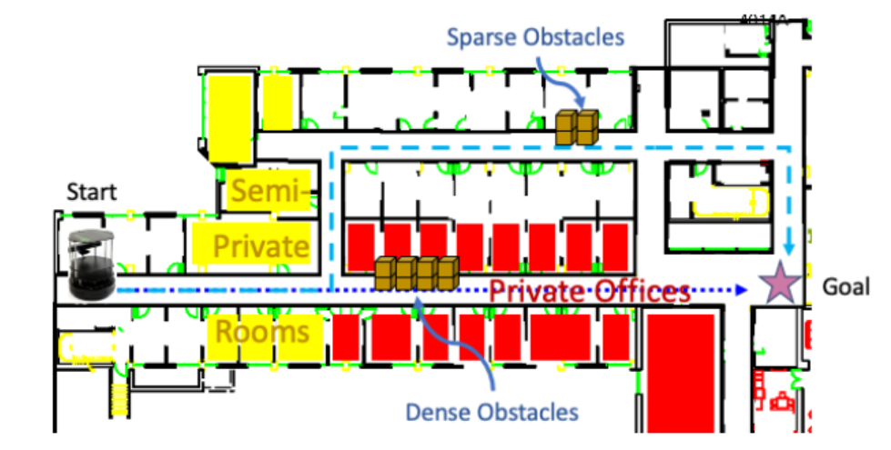
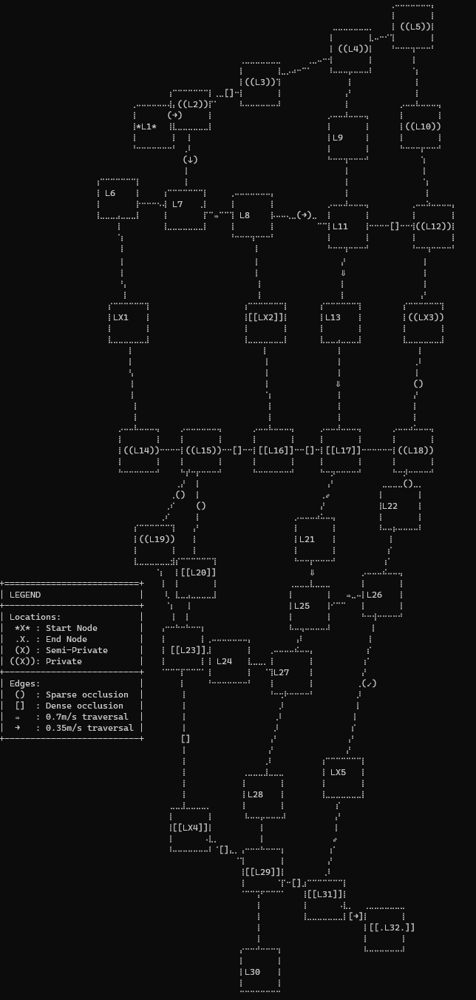
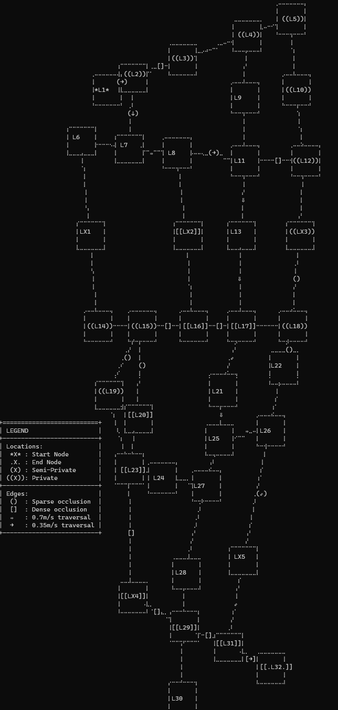

# Indoor Robot Navigation Example



The figure above shows a mobile robot
whose task is to drive from its current location to a goal location in a building. The robot
has to arrive at the goal as soon as possible, while trying to avoid collisions for its own safety
and to avoid driving intrusively through human-occupied areas. The robot has access to the
building’s map (locations, and connections and distances between them), placement and density
of obstacles (sparse or dense obstacles), and the kinds of areas in the environment (public, private,
and semi-private areas). The robot can determine its current location, knows its current driving-
speed setting, and can detect when it bumps into obstacles. The robot can also navigate between
two adjacent locations, and change its driving speed between two settings: full- and half-speed.

When the robot drives at its full speed through a path segment that has obstacles, it has some
probability of colliding, depending on the density of the obstacles. Furthermore, the intrusiveness
of the robot is based on the kinds of areas the robot travels through. The robot is non-intrusive,
somewhat intrusive, or very intrusive when it is in a public, semi-private, or private area, respectively.

The figure shows an example of a tradeoff reasoning the robot might have to make. Suppose
the robot computes the dashed path as its solution. The robot could provide its rationale by
showing the alternative dotted path that is more direct, and explaining that while the dashed path
takes longer travel time than the direct dotted path, it has lower intrusiveness and lower chance
of collision.

## Modeling the planning domain with XMDP XPlanner APIs

To generate a contrastive explanation for a plan (as well as a plan itself) requires modeling the planning problem 
in the XPlanning framework, which involves defining (1) the state space for the problem (e.g., the altitude and formation 
of the UAV team); (2) the actions that can be applied in states to transition the MDP to new states; (3) a factored representation
of states X actions -> new states that capture the conditions in states where actions can be applied, and the probability
distribution of new states that will be transitioned to after applying an action; (4) the qualities that will be used to determine
whether plans are good (called rewards in MDP) and the costs, which are negative rewards; and (5) the initial state of the system and goal
for the planner to achieve.

To bring this all together into a planning problem requires defining an `XMDPBuilder` object that defines these actions, either directly
(hardcoded in the class), or (more commonly) by taking some textual representation of a mission and using that to generate the XMDP planning 
description.

### State Variables

State variables represent information about states in the MDP, and are implemented by implementing state interfaces provided 
in the package:
`language.domain.models`.  Each of these state variables is modeled in XMDP by implementing the 
`language.domain.models.IStateVarValue` 
interface or one of its primitive derivatives: `IStateVarInt`, `IStateVarDouble` or `IStateVarBoolean`, which 
provide state variables 
represented by integers, doubles, or booleans respectively. Furthermore, any state variable may have attributes that provide 
more detail about 
the state variable. Such information might, for example, describe the units of the state variable, or the probability 
distribution of the value.

The state space for the indoor service robot is defined by the following two variables:

- [Robot Location](models/Location.java), which is the current location of the robot, which will be drawn from a set of 
waypoints on a map, and
- [Robot Speed](models/RobotSpeed.java), which is the current speed setting for the robot, as an implementation of 
`IStateVarDouble`. Although the robot may have discrete levels of
speed settings, for instance, full speed and half speed, we define RobotSpeed as a floating point
type to allow the *rSpeed* variable to be used directly in computation of QA values.

Note that in this example domain, we choose not to include the state of the robot’s bump
sensor as a state variable for simplicity. However, the collision concern of the robot can still be
captured via other XMDP constructs, as we will discuss.

As mentioned above, XMDP allows us to define attributes associated with state variables that can be used in planning
to provide additional information about a state variable. We define the following state-variable attributes 
associated with the Location type: ID representing the unique ID of a particular
location, and [Area](models/Area.java) representing the type of area in which the location is, which can be one of
the following types: public, semi-private or private. Some examples of public areas include hallway and cafeteria, 
semi-private areas include conference rooms and student lounges, and private areas include faculty offices.

### Actions

To define the possible actions that can be applied in the MDP, XMDP provides the `language.domain.models.IAction` interface. Note that actions are representations of the possible actions that can be performed, and do not execute the actions themselves. The effects of actions on states are defined in the transition model.

An `Action` in XMDP is composed of a name for the action, any parameters (state variable values) for the action, and attributes. 

For the mobile robot example, we define the following action types:

- Move To ([MoveToAction](models/MoveToAction.java)): to move the robot to a particular location. The action takes a `Location` object representing the waypoint for the robot to move to. The action has two attributes associated with it: `distance` and `occlusion` that denote the distance and obstacle density of the path between the source and destination locations of the action. `distance` (implemented by [Distance](models/Distance.java)) is a floating point and `occlusion` (implemented by [Occlusion](models/Occlusion.java))can be one of `sparse`, `dense`, `none`.

- Set Robot Speed ([SetSpeedAction](models/SetSpeedAction.java)): sets the speed of the robot, parameterized by [RobotSpeed](models/RobotSpeed.java).

### Transition Models

Transition models describe how states and actions can be used to transition to other states. To represent a transition model, we use factored probabilistic STRIPS operators (called PSOs) to describe the preconditions and context dependent, stochastic effects of each action type. type. A factored PSO consists of a set
of mutually exclusive and exhaustive logical formulae, called *contexts*, and a *stochastic effect*
associated with each context. A stochastic effect is a set of *change sets* – a list of variable values
– with a probability attached to each change set. A transition model requires specifying the following:

1. The types of state variables that a transition can use as a source, called the discriminant class. For example, the `MoveTo` action has a discriminant class which is the robot's location. The `SetSpeed` action type is discriminated by the Speed variable.
2. The preconditions for the transition (for example, a `MoveTo` to a certain location has the precondition that the robot is at one of the adjacent waypoints; the `SetSpeed` action has a precondition that the robot is not currently at the desired speed.
3. The state variable type(s) that the action will effect, called the effect class. In this case the effect classes are the same as the discriminant classes (e.g., `MoveTo` has a `Location` effect class)
4. The effect that the transition has on the state, as a probabilistic effect. For example, `MoveTo` affects the current location to be the target location.

1, 3, and 4 are specified by implementing the `language.mdp.IActionDescription` interface. 1 and 3 use classes defined in the state variable model, and 4 is implemented to return a `language.mdp.ProbabilisticEffect`. In most cases where the effect is the result of some formula, the `IActionDescription` implementation will delegate to a `language.mdp.FormulaActionDescription` instance which is a generic action description of a specific effect class. 
A "formula" action description functionally maps a set of mutually exclusive discriminants to the corresponding probabilistic
effects. This description will further delegate to a `language.domain.models.IProbabilisticTransitionFormula` specialized for the action that calculates the result of applying the action in the state.

If we look at the class [RobotLocationActionDescription](models/RobotLocationActionDescription.java) we can see all the information put together in the constructor: The discriminant class is `Location`, the effect class is also `Location`, and the effect is a [RobotLocationFormula](models/RobotLocationFormula.java) which uses the `occlusion` property of the `MoveTo` action to probabilistically move the robot (in the example currently, it is assumed that the robot can navigate through any set of obstacles, but it might bump into some of them -- bumping being represented elsewhere).

### Quality Attribute Analytic Models

We define the following quality attributes (QAs): travel time, expected collisions, and intrusiveness.

**Travel Time**: We define `TravelTime` as the standard measurement QA. The `TravelTime` value
of a single transition is a function of the state variable *rSpeed* and the action attribute `Distance`
of a `MoveTo` action. No travel time is incurred under other action types. 

This information is encoded in the [TravelTimeDomain](metrics/TravelTimeDomain.java), which specifies that the domain and action for this quality, which depends on the `Location` and `Speed` state variables. It specifies the `MoveTo` action as the action, and in turn affects the robot's `Location`. Distances and occlusions are accessed from the `MoveTo` actions associated attributes. [TravelTimeQFunction](metrics/TravelTimeQFunction.java) is used to calculate the travel time given the speed and distance between traveled, as well as some potential delays for occlusions.

**Collision**: We define Collision ([CollisionEvent](metrics/CollisionEvent.java)) as an event for a count-of-events QA. 
As noted, we do not include the state of the robot’s bump sensor as a state variable. Instead, we define probabilities of
the Collision event occurring given different levels of obstacle density of a path segment when the
robot moves. That is, the Collision probability of a single transition is a function of the action
attribute `obstacle` of a `MoveTo` action: the probability is 0.0, 0.2, and 0.4 when the obstacle
density is none, sparse, and dense, respectively (encoded in the `getEventProbability` method of 
`CollisionEvent`). Probability of a Collision event is 0 under other action types. 

[CollisionDomain](metrics/CollisionDomain.java) captures the information about the domain and and action that this quality applies to (i.e., the robot location, its speed, and the `MoveTo` action). Occlusion is accessed as an attribute of the `MoveTo` function passed into the constructor. 

**Intrusiveness**: We define Intrusiveness ([IntrusivenessMoveEvent](metrics/IntrusivnessMoveEvent.java) and [IntrusivenessDomain](metrics/IntrusivenessDomain.java)) as a 
non-standard measurement QA. To this end,
we define a set of events: *non-intrusive*, *somewhat-intrusive*, and *very-intrusive* to characterize 
the level of intrusiveness of the robot when it moves into a particular location. These
events are defined by the state-variable attribute `Area` of the destination `Location` argument
of a `MoveTo` action. Namely, *non-intrusive*, *somewhat-intrusive*, and *very-intrusive* events correspond 
to when the robot moves into public, semi-private and private areas, respectively. We
assign arbitrary penalty values of 0, 1, and 3 to these events, respectively, to quantify their relative
severity. 

### Cost Function
We define the cost function for this example as a a composition of the sub-costs of the different QAs, *C*<sub>i</sub> for i in *<TravelTime, Collision, Intrusiveness>.* Specifically, we normalize each quality attribute by dividing the observed value by the maximum that the value could be, and then linearly combine it with a preference function.

## Generating an explanation

Once we have defined all the constituent parts, we need to put them together a class that represents the XMDP planning 
problem which is used both to generate plans and explanations. For the Mobile Robot example, this is done in class [MobileRobotXMDPBuilder](dsm/MobileRobotXMDPBuilder.java), which composes all 
the possible states, actions, transition functions, qualities, and costs that we defined prior. This class follows the 
builder pattern, and takes in a mission specification and produces the XMDP for that mission. For this example, we specify 
the mission in a JSON formatted file that takes the form:

```javascript
{
	"map-file": "GHC7-map0.json", // The map file to use (see below for the format)
	                             // Not that the location is passed in as the Maps.Path 
	                             // property in the configuration file of the main program
	"start-id": "L1",            // The identifier of the starting waypoint for the mission
	"goal-id" : "L32",           // The identifier of the goal waypoint for the mission
	"preference-info": [         // The set of preferences for the qualities in this mission
	  {
	    "scaling-const": 34.37,  // The constant to use in the normalization for the cost function
	    "min-step-value": 0.0,
	    "max-step-value": 34.37,
	    "objective": "travelTime" // The quality attribute to apply this to
	  },
	  ...                         // One similar object is needed per quality attribute 
}
```

### map-file

The `map-file` component of the mission points to a JSON formatted file containing information about the map that the robot is tasked to traverse. A map in this example is a graph of waypoints and their connections, along with information about the distance between the waypoints, the privacy of the waypoint, and the occlusion value along edges. If we look at the file [GHC7-map0.json](../../../data/mobilerobot/maps/GHC7-map0.json) we can see that it is composed of three parts:

- `mur`: The Meter-to-unit ratio for the coordinates in the map. In this case, a distance of 1 unit is 10 meters.
- `map`: An array of waypoints that define the map graph. Each waypoint is of the form:
    
```javascript
   "area": "<PRIVACY>",    // <PRIVACY> can be PUBLIC, SEMI_PRIVATE, or PRIVATE
   "node-id": "<ID>",      // The identifier of the node
   "coords": {
     "x": "<double>",      // The x location of the waypoint
     "y": "<double>",      // The y location of the waypoint
   },
   "connected-to": [...]   // An array of identifiers of waypoints that this location 
                           // is connected to
```

- `obstacles`: An array of edges and how occluded they are (unmentioned edges are assumed to have no obstacles). Each occlusion item is of the form:

```javascript
   "occlusion": "<OCCLUSION> // <PRIVACY> can be PARTIALLY_OCCLUDED or OCCLUDED
   "to-id": "<ID>"           // The identifier of the node at one end of the edge
   "from-id": "<ID>"         // The identifier of the node at the other end of the edge
```

The map is read into a [MapTopology](dsm/MapTopology.java) by the [MapTopologyReader](dsm/parser/MapTopologyReader.java) reads the JSON to construct the graph of the map as [LocationNode](dsm/LocationNode.java) and [Connection](dsm/Connection.java). Occlusion information is processed by the [OcclusionParser](dsm/parser/OcclusionParser).


The mission and the associated files are read into an object [Mission](dsm/Mission.java) that is used to represent the mission. This is loaded in [MobileRobotXMDPLoader](demo/MobileRobotXMDPLoader.java) and then the planning space is built by [MobileRobotXMDPBuilder](dsm/MobileRobotXMDPBuilder.java).
`MobileRobotXMDPBuilder` does not have an API interface, it has to seven things that will be common to all builders of 
XMDPs, and which can be found in `MobileRobotXMDPBuilder.buildXMDP`.

1. Build the state space (`MobileRobotXMDPBuilder.buildStateSpace`): This method instantiates state variables that make up the state space. For each node in the map, a `Location` state variable is constructed with the associated `Area` definition attributed to it. The `RobotSpeed` state variable is hardcoded in the `rSpeedDef` member.

2. Build the action space (`MobileRobotXMDPBuilder.buildActionSpace`): For each location, a `MoveToAction` instance is created. For each reachable waypoint from that location (accessed through the map connections), the distance and occlusion are retrieved from the map, and an attribute keyed by that location is added to the action. (E.g., if `L1` is connected to `L2` by a `sparse`ly occluded 10m connection, then a `MoveToAction(L2)` is constructed. If in the MDP the plan is issueing this action from the point `L1`, then these distance and occlusion attributes are used in quality calculations).

3. Build the initial state (`MobileRobotXMDPBuilder.buildInitialState`): This sets the initial state to be the `start-id` of the mission and the default speed of the robot (0.35m/s).

4. Build the goal (`MobileRobotXMDPBuilder.buildGoal`): This is set to the `goal-id` of the mission.

5. Build the transition function (`MobileRobotXMDPBuilder.buildTransitionFunction`) mapping states to values. This involves 

     1. Defining preconditions for actions in the action space
     2. Defining action descriptions for each action
     3. Defininng the transition function (an instance of `language.mdp.FactoredPSO`) that defines the factored representation of the MDP.
     
    Let's take a look at the transition function for the `MoveToAction` instances. For each `MoveToAction` (e.g., `MoveToAction(L2)`, `MoveToAction(L10)`), we find the connected nodes and set a precondition that states that for `MoveToAction(L2)` to be valid, the robot has to be in one of the adjacent locations to `L2`. We then construct a [RobotLocationActionDescription](models/RobotActionDescription.java) object that combines the discriminant and effect classes, the preconditions for the actions, and the probability of achieving the actions to define the function. Finally, the factored PSO is constructed with this action description an added to the set of transition functions.
    
    A similar PSO is constructed for setting the robot speed (e.g., to set the speed to full speed, the current state of speed needs to be default speed).
    
6. Build the quality space (`MobileRobotXMDPBuilder.buildQFunctions`). For each of the qualities we are concerned about, we build a function to calculate the quality value for the quality attribute. For the `travelTime` using a `TravelTimeQFunction`, and for `Collsion` we build a counting quality function.

    For `Intrusivness`, as stated above, we use a non-standard QFunction [NonStandardMetricQFunction](../../language/domain/metrics/NonStandardMetricQFunction.java) that calculates the value based on the privateness of the area.
    
7. Build the cost function (`MobileRobotXMDPBuilder.buildCostFunction) as the linear combination of the normalized and scaled quality values in the quality space.

With all this information, we have defined a Markov Decision Process for the plan that can be used to (a) generate policies, and (b) generate explanations for the policies.

## Generating an explanation

Finally, after building the planning problem space as above, we can generate an explanation by running the planner to generate the plan as well as an internal representation of the explanation. To render this plan, we use have to define how to render it which requires a custom render for the plan itself as well as way to render the explanation. In this example, we use a text based explanation renderer, which just renders the explanation in plain text. The policy is rendered using a MobileRobot-specific renderer to render the plan ([MapBasedPolicyRenderer](viz/MapBasedPolicyRenderer.java). All of this is done in [MobileRobotPlanner](demo/MobileRobotPlanner.java). When running this class on [mission0](../../../data/mobilerobot/missions/mission0.json), it generates the following explanation:

```
Explanation: (/explanations/mission0_explanation.json)
============
I'm planning to follow this policy [Solution] (below). It is expected to have 0.0 expected collision (0.0 in cost); take
165.78068230493494 seconds (165.78068230493497 in cost); and have intrusiveness-penalty of 10.0: it will be
non-intrusive at 8.0 locations (0.0-penalty), somewhat-intrusive at 1.0 location (1.0-penalty), and very-intrusive at
3.0 locations (9.0-penalty) (110.0 in cost). It has the lowest expected intrusiveness, and collision.

Alternatively, following this policy [Alternative 0 (below)] would reduce the expected travel time by 17.19041023612138
seconds (-17.190410236121437 in cost). However, I didn't choose that policy because it would increase the expected
collision by 0.20000000000007512 (+20.00000000000751 in cost). The decrease in expected travel time is not worth the
increase in expected collision.

Solution
========
```


```
Qualities:
  +-------------------------------+
  | Quality       | Value         |
  +===============================+
  | collision     | 0.00          |
  +-------------------------------+
  | travelTime    | 165.78        |
  +-------------------------------+
  | intrusiveness | 10.00         |
  +-------------------------------+

Alternative 0
=============
```


```
Qualities:
  +-------------------------------+
  | Quality       | Value         |
  +===============================+
  | collision     | 0.20          |
  +-------------------------------+
  | travelTime    | 148.59        |
  +-------------------------------+
  | intrusiveness | 10.00         |
  +-------------------------------+
```